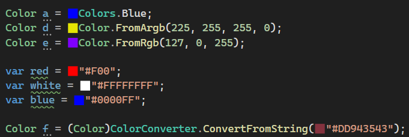

# C# Inline Color Visualizer

See samples of the colors you use within your C# code.  
Never again be forced to remember what a named color looks like or work out what color a HEX value represents.

Works with `*.cs`, `*.cshtml`, and `*.razor` files.
